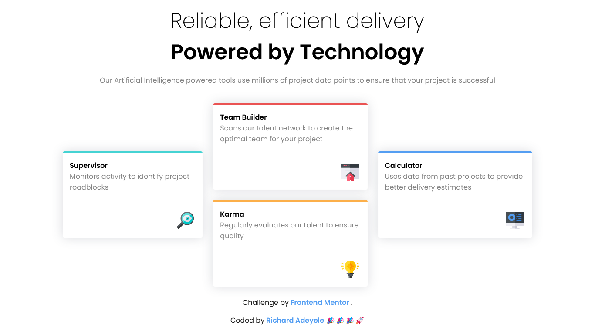

# Frontend Mentor - Four card feature section

This is a solution to the [Four card feature section on Frontend Mentor](https://www.frontendmentor.io/challenges/four-card-feature-section-weK1eFYK/hub). Frontend Mentor challenges help you improve your coding skills by building realistic projects.

## Table of contents

- [Overview](#overview)
  - [Screenshot](#screenshot)
  - [Links](#links)
- [My process](#my-process)
  - [Built with](#built-with)
  - [What I learned](#what-i-learned)
- [Author](#author)

## Overview

### Screenshot



### Links

- Solution URL: [QR Code Challenge](https://github.com/Richlee-demo/fcsc/blob/main/index.html)
- Live URL: [QR Code Challenge](https://richlee-demo.github.io/fcsc/)

## My process

### Built with

- HTML
- CSS

### What I learned

During the process of tackling my third challenge, I must say that I am thrilled with the progress that I have made so far. In the process, I have gained valuable skills such as creating custom CSS styles that are reusable and previewing my local files on mobile devices, similar to how Figma Mirror works. Although this challenge was particularly tough due to the layout of the cards, I am delighted to have designed them appropriately and made them fully responsive. This experience has given me a great sense of satisfaction, as it has allowed me to test my skills and grow as a developer. I am eager to take on more challenges and continue to refine my craft.

```html
<h1>Some CSS code I'm proud of</h1>
```

```css
* {
  margin: 0rem;
}
:root {
  /* Colors */
  /* Primary colors */
  --primary-color-red: hsl(0, 78%, 62%);
  --primary-color-cyan: hsl(180, 62%, 55%);
  --primary-color-orange: hsl(34, 97%, 64%);
  --primary-color-blue: hsl(212, 86%, 64%);
  /* Secondary colors */
  --neutral-color-900: hsl(234, 12%, 34%);
  --neutral-color-500: hsl(229, 6%, 66%);
  --neutral-color-50: hsl(0, 0%, 98%);
  /* Text colors */
  --text-color: #1a1a1a;
  /* Shadow colors */
  --shadow: 0 0 1.5rem hsla(234, 12%, 34%, 0.205);

  /* Font sizes */
  /* Heading */
  --h1-font-size: 3rem;
  --h2-font-size: 2.5rem;
  --h3-font-size: 2rem;
  --h4-font-size: 1.5rem;
  --h5-font-size: 1.25rem;
  --h6-font-size: 1rem;
  /* Body */
  --body-text-font-size: 1rem;
  /* Caption */
  --caption-font-size: 0.75rem;

  /* Font weights */
  --font-weight-light: 200;
  --font-weight-regular: 500;
  --font-weight-bold: 900;

  /* Padding */
  --padding-x: 0.25rem;
  --padding-xx: 0.5rem;
  --padding-xxx: 1rem;
  --padding-xxxx: 1.5rem;
  --padding-xxxxx: 2rem;
  --padding-xxxxxx: 2.5rem;
}

/* Class definition for Body & Caption */
.light {
  font-weight: var(--font-weight-light);
}
.regular {
  font-weight: var(--font-weight-regular);
}
.bold {
  font-weight: var(--font-weight-bold);
}

/* Class definition for Headings */
h1 {
  font-size: var(--h1-font-size);
  font-weight: var(--font-weight-bold);
}
h2 {
  font-size: var(--h2-font-size);
  font-weight: var(--font-weight-bold);
}
h3 {
  font-size: var(--h3-font-size);
  font-weight: var(--font-weight-regular);
}
h4 {
  font-size: var(--h4-font-size);
  font-weight: var(--font-weight-bold);
}
h5 {
  font-size: var(--h5-font-size);
  font-weight: var(--font-weight-regular);
}
h6 {
  font-size: var(--h6-font-size);
  font-weight: var(--font-weight-bold);
}
.x {
  padding-top: var(--padding-x);
}
.xx {
  padding-top: var(--padding-xx);
}
.xxx {
  padding-top: var(--padding-xxx);
}
.xxxx {
  padding-top: var(--padding-xxxx);
}
.xxxxx {
  padding-top: var(--padding-xxxxx);
}
.xxxxxx {
  padding-top: var(--padding-xxxxxx);
}
```

```css
/* Hover state */
.cyan:hover {
  background-color: var(--primary-color-cyan);
  color: var(--neutral-color-50);
}
.red:hover {
  background-color: var(--primary-color-red);
  color: var(--neutral-color-50);
}
.orange:hover {
  background-color: var(--primary-color-orange);
  color: var(--neutral-color-50);
}
.blue:hover {
  background-color: var(--primary-color-blue);
  color: var(--neutral-color-50);
}
```
## Author

- Website - [Richard Adeyele](https://app.uxcel.com/ux/LMA2N5TROOXQ)
- Frontend Mentor - [@Richlee-demo](https://www.frontendmentor.io/profile/Richlee-demo)
- Twitter - [@JCRichLee](https://www.twitter.com/JCRichLee)
